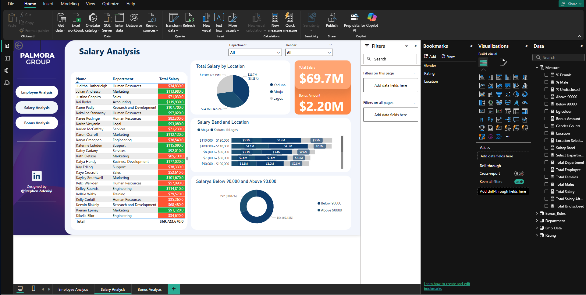
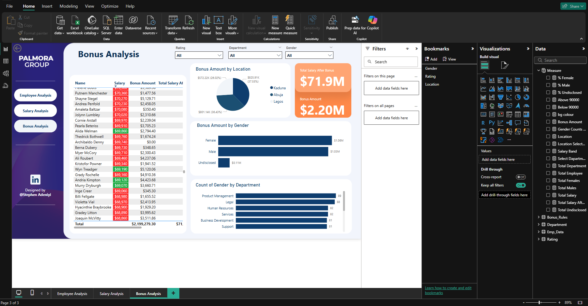

# Palmora Group HR Analysis (Power BI Project)

## 📘 Case Study 3 – Gender Equality and Compensation Review

This Power BI report analyzes HR data from **Palmora Group**, a Nigerian manufacturing company currently facing gender inequality allegations across its regions. The analysis provides insights and recommendations to support the management team in addressing gender-related concerns and ensuring equitable practices company-wide.

---

## 🎯 Objective

To analyze and visualize HR data to:
- Assess gender distribution across the organization.
- Uncover any gender-based differences in performance ratings and salary.
- Check compliance with regulatory salary benchmarks.
- Allocate bonus payments based on performance.
- Provide clear, actionable insights to aid strategic HR decisions.

---

## 🔧 Tools & Technologies

- **Power BI Desktop**
- **Power Query** – for data cleaning and transformation.
- **DAX (Data Analysis Expressions)** – for creating measures and KPIs.
- **Data Modeling** – for creating relationships and building a semantic layer.
- **Power BI Visualizations** – for building dashboards and charts.

---

## 🧼 Data Cleaning (via Power Query)

Steps taken to prepare the dataset:
- Replaced missing gender values with `"Undisclosed"`.
- Filtered out employees with:
  - No salary (inactive employees).
  - "NULL" as department.
- Formatted salary and rating columns as numeric values.
- Ensured consistent column naming and removed duplicates.

---

## 🧠 Data Modeling

- Connected `Employee Data` table with the `Bonus Rules` table via performance rating.
- Built a star schema model for efficient slicing and aggregation.
- Created hierarchies for Region → Department for drill-down analysis.

---

## 🧮 DAX Measures

Custom DAX measures were created to enable dynamic insights, including:

- **Total Salary**
- **Total Bonus**
- **Total Compensation (Salary + Bonus)**
- **Employee Count by Gender**
- **Average Salary by Gender, Department, and Region**
- **Salary Bands Grouping (in $10,000 increments)**
- **Employees Below $90,000 Threshold**

---

## 📊 Dashboard Previews

| Employee Analysis | Salary Analysis | Bonus Analysis |
|----------------|------------------|------------------|
|  |  |  |

---

## 📁 Project Files

